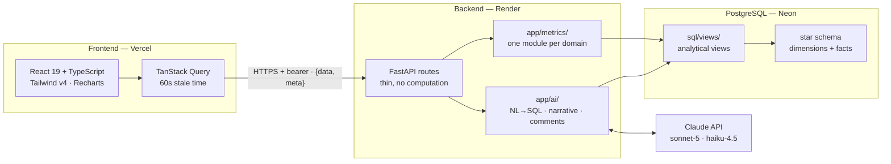

# Architecture

Updated at the end of each phase. **Current state: phase 0 (foundation) complete.**

## Shape

## Layer responsibilities

| Layer | Owns | Never does |
|---|---|---|
| `app/api/routes/` | Input validation, filter parsing, envelope wrapping | Compute a metric |
| `app/metrics/` | Every formula in `docs/METRICS.md` | Touch HTTP concerns |
| `sql/views/` | Pre-aggregation to metric grain; the NL→SQL allowlist boundary | Expose base tables to generated SQL |
| `app/ai/` | Claude calls, caching, graceful degradation | Compute a metric itself |
| `frontend/` | All formatting — percent, currency, rounding, dates | Recompute a metric client-side |

## Decisions and why

- **Views as the read surface.** They pre-aggregate to metric grain *and* act as the
  security boundary for natural-language querying — generated SQL selects from
  allowlisted views only, never base tables.
- **Rate metrics expose numerator and denominator separately** in views, with the
  denominator being average headcount for the period. Enforcing that in one place is why
  the most common bug in HR analytics can't creep in per-metric.
- **`/health` never touches the database.** Render polls it during cold start;
  readiness is a separate explicit check at `/health/db`.
- **`pool_pre_ping=True`** on the engine — Neon closes idle connections, and without it
  the first query after an idle period fails instead of reconnecting.
- **Alembic reads `DATABASE_URL` from `app.config`, not `alembic.ini`.** Migrations, the
  app, and the seed generator therefore cannot drift onto different databases, and no
  credential lands in a tracked file.

## What exists now (phase 0)

- FastAPI app with `/`, `/health`, `/health/db`; CORS for the Vite origin; the
  `{data, meta}` envelope enforced by `app/schemas/`.
- SQLAlchemy 2.0 engine, session factory, `DeclarativeBase`. **Zero models yet.**
- Alembic initialised and wired to `app.models.Base.metadata`. **Zero migrations yet.**
- Vite + React + TS strict + Tailwind v4 + TanStack Query, building clean; the shell
  fetches `/health` to prove the request path end to end.
- `docker-compose.yml` for local Postgres.
- 4 passing tests.

## Next

Phase 1 designs the star schema, generates the first migration, and replaces the
diagram above with the full ERD.
